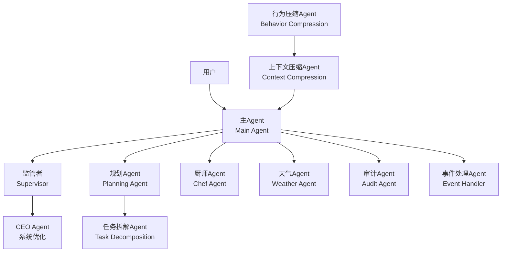
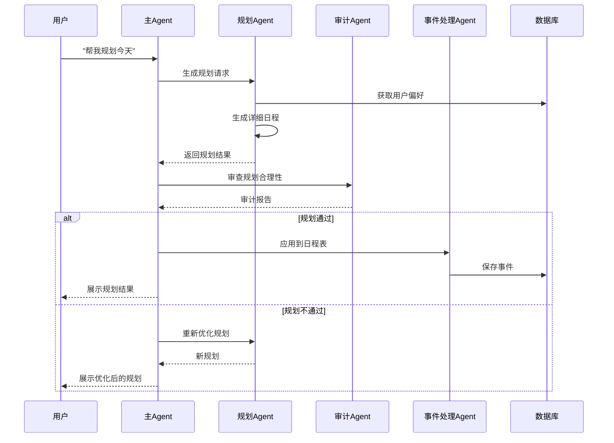
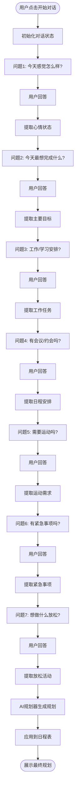
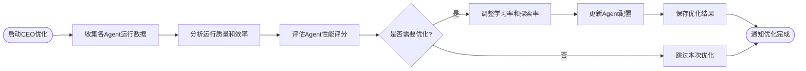
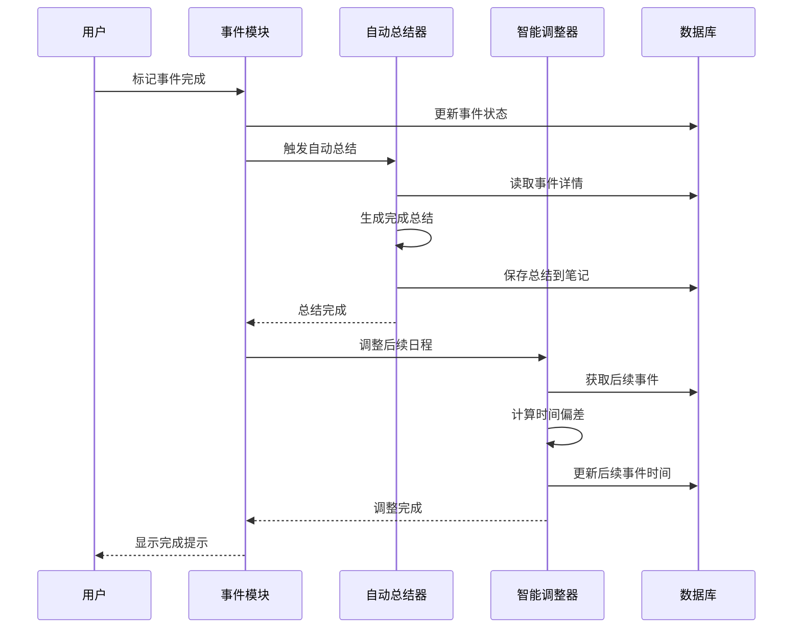

# 时灵LLM - AI 个人日程管理系统

| 项目信息 | |
|---------|-----|
| **当前版本** | v1.0.0 |
| **发布日期** | 2026-04-14 |
| **协议** | AGPL-3.0 |

## 项目简介

时灵LLM 是一个基于 FastAPI 和大语言模型的智能日程管理系统，提供自然语言交互、智能规划、日程管理、数据统计等功能。

## 版本历史

### v1.0.0 (2026-04-14)

#### 架构
- 基于 FastAPI 的后端框架
- SQLite + SQLAlchemy 数据存储
- 模块化多智能体系统设计
- SSE 实时通信机制

#### 功能
- 自然语言对话交互
- 多身份预设（学生、上班族、自由职业者、退休/悠闲）
- 多管家风格（经典管家、猫娘、女仆、执事、傲娇、姐姐、武士、AI助手）
- 时间线树形视图（年/月/日）
- 事件详情展示（时间、地点、人物、任务流程）
- 每日自动规划生成
- 智能日程优化编排
- 笔记与总结管理
- 周/月数据统计
- 食谱管理与饮食计划
- 多智能体协同工作

#### Debug & 维护
- 完善的 API 接口文档
- 模块化服务设计，便于调试
- 详细的错误日志记录
- 数据库迁移脚本
- 单元测试框架支持

---

## 开源协议

本项目采用 **GNU Affero General Public License v3.0 (AGPL-3.0)** 协议开源。

### 主要条款

- 允许免费使用、修改、分发本项目
- 允许用于个人学习和研究用途
- 禁止将本项目或其衍生作品用于任何商业用途
- 修改后的代码必须以相同协议开源
- 必须保留原始版权声明
- 若通过网络提供本项目服务，必须向用户提供源代码

详见 [LICENSE](LICENSE) 文件。

---

## 功能特性

### 对话管理

- 自然语言对话接口
- 多种管家风格预设
- 多身份配置支持
- 主动对话与规划

### 日程管理

- 时间线树形视图
- 事件创建、编辑、删除
- 优先级分类
- 状态跟踪
- 事件详情展示

### 智能提醒

- SSE 实时推送
- 可配置的提前提醒时间
- 桌面通知支持

### AI 规划

- 日程自动优化编排
- 每日规划生成
- 智能调整后续日程
- 基于用户习惯的个性化配置

### 笔记与总结

- 规划过程记录
- 事件完成总结
- 反思记录
- 标签分类
- 搜索功能

### 数据统计

- 周/月完成率统计
- 优先级分布分析
- 趋势展示
- 智能建议生成

### 食谱管理

- 食谱库管理
- 每周饮食计划
- 营养分析
- 购物清单生成

### 多智能体系统

- 模块化智能体设计
- 任务拆解与协同
- 自我优化机制
- 状态监控

---

## 系统架构

### 技术栈

- **后端框架**: FastAPI
- **数据库**: SQLite 3 + SQLAlchemy
- **前端**: 原生 JavaScript + Tailwind CSS
- **图表**: ECharts
- **图标**: Iconify
- **实时通信**: SSE (Server-Sent Events)

### 项目结构

```
daily-assistant/
├── main.py                 # FastAPI 应用入口
├── config.py               # 配置管理
├── requirements.txt        # Python 依赖
│
├── app/                    # 应用核心模块
│   ├── __init__.py
│   ├── database.py         # 数据库连接
│   ├── models.py           # 数据模型
│   ├── cli/               # 命令行工具
│   │   ├── __init__.py
│   │   └── main.py
│   ├── services/          # 业务逻辑服务
│   │   ├── __init__.py
│   │   ├── chat_service.py
│   │   ├── event_service.py
│   │   ├── note_service.py
│   │   ├── recipe_service.py
│   │   ├── weather_service.py
│   │   ├── settings_service.py
│   │   ├── preferences_service.py
│   │   ├── reminder_engine.py
│   │   ├── scheduler.py
│   │   ├── ai_scheduler.py
│   │   ├── advanced_scheduler.py
│   │   ├── plan_reviewer.py
│   │   ├── smart_adjuster.py
│   │   ├── auto_summarizer.py
│   │   ├── smart_butler.py
│   │   ├── proactive_butler.py
│   │   ├── smart_chat_service.py
│   │   ├── conversation_state.py
│   │   ├── trigger_service.py
│   │   ├── sse_manager.py
│   │   └── multi_agent_system/
│   └── templates/         # 前端模板
│       ├── index.html
│       └── recipes.html
│
├── data/                   # 数据目录（Git 忽略）
│   └── assistant.db
│
├── docs/                   # 项目文档
│   └── API.md
│
├── .env                    # 环境变量（Git 忽略）
├── .gitignore
├── LICENSE
├── README.md
├── CONTRIBUTING.md
└── CODE_OF_CONDUCT.md
```

---

## 快速开始

### 环境要求

- Python 3.10 或更高版本
- SQLite 3
- 现代浏览器（Chrome、Firefox、Safari、Edge）

### 安装步骤

1. 克隆或下载项目代码

2. 安装 Python 依赖

```bash
pip install -r requirements.txt
```

3. 配置环境变量

复制并编辑 `.env` 文件：

```env
# LLM API 配置
LLM_API_KEY=your_api_key_here
LLM_BASE_URL=https://api.deepseek.com/v1
LLM_MODEL=deepseek-chat

# 系统配置
DEFAULT_REMINDER_MINUTES=10
USER_NAME=用户

# 天气 API 配置（可选）
WEATHER_API_KEY=your_weather_api_key
WEATHER_API_URL=https://devapi.qweather.com/v7
WEATHER_CITY=北京
```

4. 初始化数据库

首次运行前，确保数据库表结构正确。系统会自动创建所需的表。

5. 启动服务

```bash
# 开发模式
fastapi dev main.py

# 生产模式
fastapi run main.py --host 0.0.0.0 --port 8000
```

6. 访问应用

打开浏览器访问：http://127.0.0.1:8000

---

## 核心模块说明

### 对话模块

- **smart_chat_service**: 智能聊天服务，处理自然语言交互
- **proactive_butler**: 主动管家，引导用户完成日常规划
- **conversation_state**: 对话状态管理

### 事件模块

- **event_service**: 事件 CRUD 操作
- **reminder_engine**: 提醒引擎，管理定时提醒
- **trigger_service**: 触发器管理

### 规划模块

- **ai_scheduler**: AI 规划器，生成每日详细规划
- **advanced_scheduler**: 高级规划器，精细化日程编排
- **plan_reviewer**: 规划审查，检查合理性
- **smart_adjuster**: 智能调整，动态优化后续日程

### 笔记模块

- **note_service**: 笔记管理
- **auto_summarizer**: 自动总结生成

### 多智能体系统

- **base_agent**: Agent 基类
- **main_agent**: 主 Agent
- **planning_agent**: 规划 Agent
- **ceo_agent**: CEO Agent，负责系统优化
- **supervisor**: 监管者
- **system_orchestrator**: 系统编排器

---

## 多智能体业务流程

### 系统架构



### 日常规划流程



### 主动对话流程



### 智能体职责说明

| 智能体 | 职责 | 触发时机 |
|--------|------|---------|
| **主Agent (Main)** | 接收用户请求，协调各智能体工作 | 用户交互时 |
| **规划Agent (Planning)** | 生成每日详细规划，优化时间安排 | 规划生成请求 |
| **任务拆解Agent** | 将大任务拆解为可执行的子任务 | 复杂任务处理 |
| **厨师Agent (Chef)** | 推荐食谱，生成饮食计划 | 菜单查询请求 |
| **天气Agent (Weather)** | 查询天气，提供出行建议 | 天气查询请求 |
| **审计Agent (Audit)** | 检查规划合理性，避免冲突 | 规划生成后 |
| **事件处理Agent** | 处理事件CRUD，状态更新 | 事件操作请求 |
| **CEO Agent** | 系统优化，调整各Agent参数 | 定期（10天）或手动触发 |
| **监管者 (Supervisor)** | 监控各Agent状态，协调资源 | 系统运行时 |
| **行为压缩Agent** | 总结用户行为模式 | 每日晚间 |
| **上下文压缩Agent** | 加载用户身份和状态 | 会话初始化时 |

### CEO 优化流程



### 事件完成后处理流程




---

## API 接口

详细的 API 接口文档请参阅 [docs/API.md](docs/API.md)。

### 主要接口

- `POST /api/chat` - 聊天对话
- `GET /api/timeline` - 时间线数据
- `POST /api/events` - 创建事件
- `PUT /api/events/{id}` - 更新事件
- `DELETE /api/events/{id}` - 删除事件
- `POST /api/plan/generate` - 生成规划
- `GET /api/notes` - 获取笔记
- `GET /api/stats/weekly` - 周统计
- `GET /api/sse` - SSE 实时推送

---

## 配置说明

### 身份预设

系统提供多种身份预设：

- 学生：早八晚十，学习为主
- 上班族：朝九晚五，工作为重
- 自由职业者：灵活安排，效率优先
- 退休/悠闲：享受生活，健康第一

### 管家风格

支持多种管家风格：

- 经典管家：专业、稳重、优雅
- 猫娘：可爱、活泼
- 女仆：恭敬、温柔、周到
- 执事：英式管家风格
- 傲娇：嘴上不饶人，其实很关心
- 姐姐：温柔、体贴、包容
- 武士：忠诚、刚毅、守信
- AI 助手：高效、精准、不带感情

---

## 贡献指南

我们欢迎各种形式的贡献。请参阅 [CONTRIBUTING.md](CONTRIBUTING.md) 了解详细的贡献流程。

### 开发流程

1. Fork 本仓库
2. 创建特性分支
3. 提交更改
4. 推送到分支
5. 创建 Pull Request

### 代码规范

- 遵循 PEP 8 代码风格
- 使用类型提示
- 添加必要的文档字符串
- 编写单元测试

---

## 行为准则

参与本项目请遵守 [CODE_OF_CONDUCT.md](CODE_OF_CONDUCT.md) 中的行为准则。

---

## 致谢

本项目使用了以下开源项目：

- [FastAPI](https://fastapi.tiangolo.com/)
- [SQLAlchemy](https://www.sqlalchemy.org/)
- [ECharts](https://echarts.apache.org/)
- [Tailwind CSS](https://tailwindcss.com/)
- [Iconify](https://iconify.design/)

---

## 版权声明

```
时灵LLM - AI 个人日程管理系统
Copyright (C) 2026

This program is free software: you can redistribute it and/or modify
it under the terms of the GNU Affero General Public License as published
by the Free Software Foundation, either version 3 of the License, or
(at your option) any later version.

This program is distributed in the hope that it will be useful,
but WITHOUT ANY WARRANTY; without even the implied warranty of
MERCHANTABILITY or FITNESS FOR A PARTICULAR PURPOSE.  See the
GNU Affero General Public License for more details.

You should have received a copy of the GNU Affero General Public License
along with this program.  If not, see <https://www.gnu.org/licenses/>.
```

---

## 免责声明

本项目仅供学习和研究使用，不得用于任何商业目的。使用本项目所产生的一切后果由使用者自行承担。
